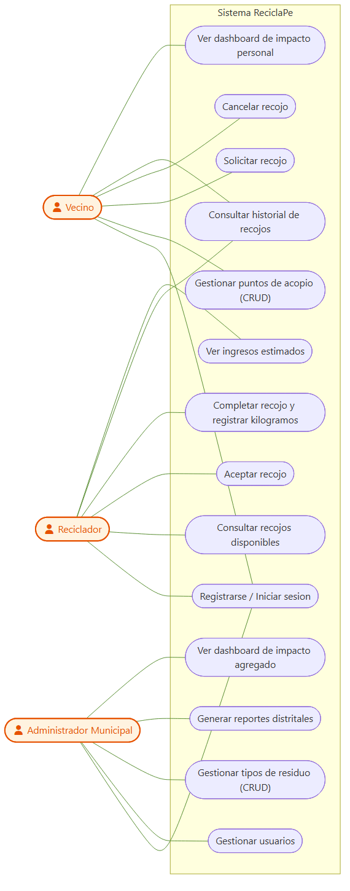
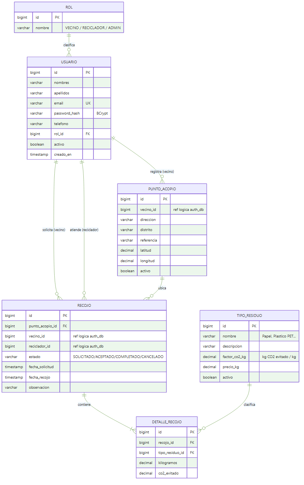
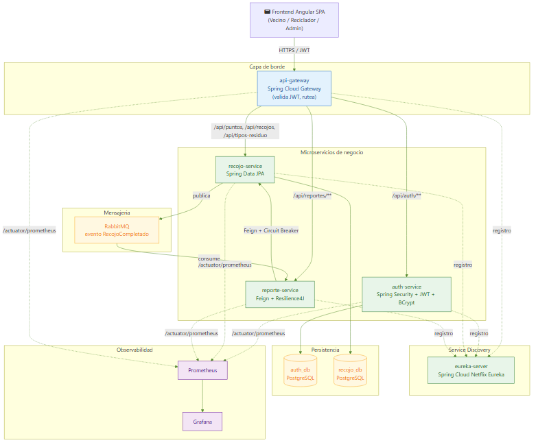
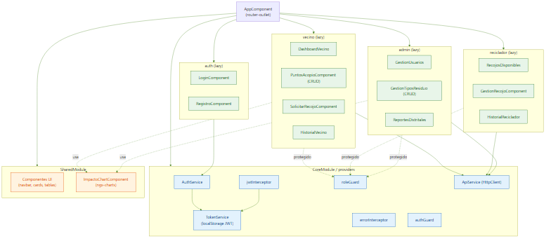
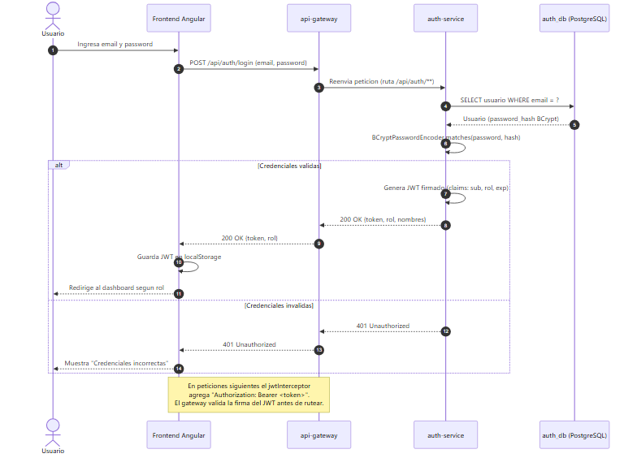
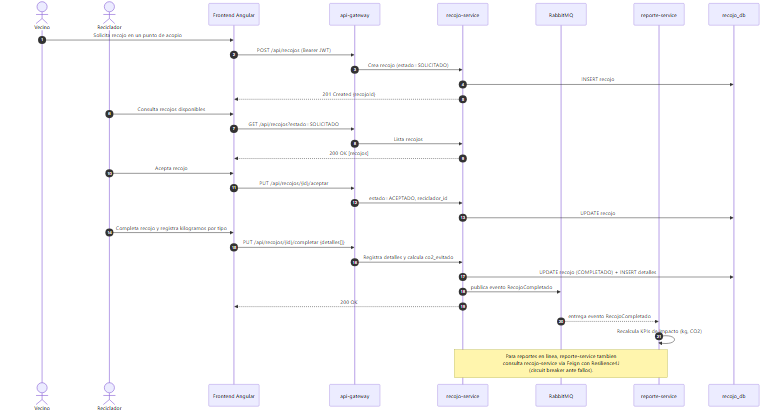
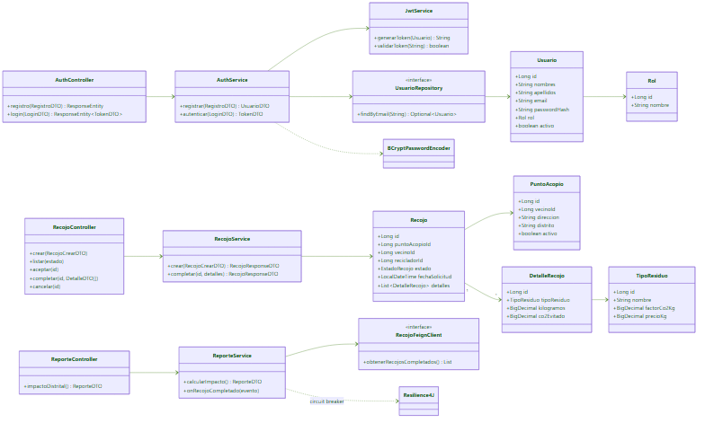
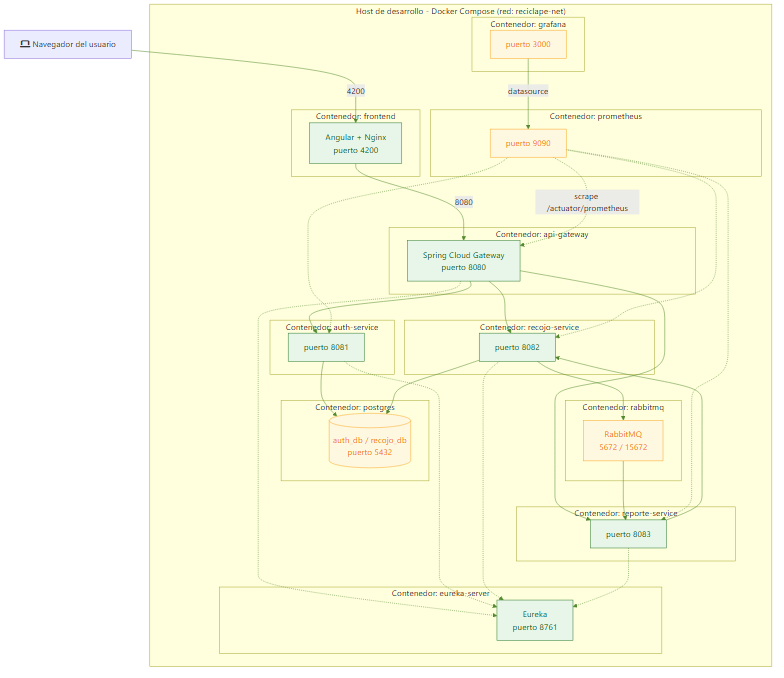
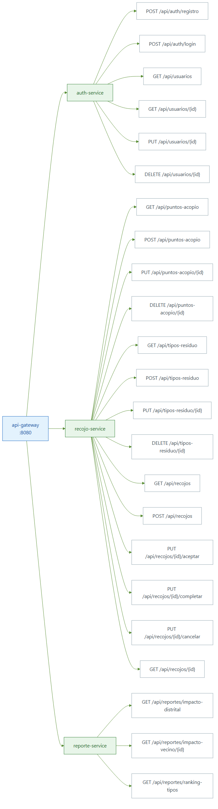

# Anexo A — Diagramas del Proyecto ReciclaPe

**Curso:** Desarrollo de Aplicaciones Web II (4697) — CIBERTEC
**Proyecto:** ReciclaPe — Plataforma de gestión de reciclaje vecinal basada en microservicios

Este anexo contiene los diagramas que sustentan el diseño técnico del proyecto. Cada diagrama
está disponible como imagen en `img/` y como código fuente Mermaid editable en `src/`
(reproducible en <https://mermaid.live> o con `mermaid-cli`).

> **Cómo regenerar las imágenes:** desde esta carpeta ejecutar
> `npx -y @mermaid-js/mermaid-cli -i src/<archivo>.mmd -o img/<archivo>.png -c mmdc-config.json -b white`

---

## 1. Diagrama de Casos de Uso

Identifica los tres actores del sistema (Vecino, Reciclador y Administrador Municipal) y las
funcionalidades que cada uno puede ejecutar. El login/registro es compartido por los tres roles.

- **Vecino:** gestiona sus puntos de acopio, solicita y cancela recojos, consulta su historial y su dashboard de impacto personal.
- **Reciclador:** consulta recojos disponibles, los acepta, los completa registrando kilogramos por tipo de residuo y revisa sus ingresos estimados.
- **Administrador Municipal:** gestiona usuarios y tipos de residuo, y genera reportes e indicadores distritales.

---

## 2. Modelo Entidad-Relación

Modelo lógico de datos. En la arquitectura de microservicios la persistencia está **separada por
servicio**: `ROL` y `USUARIO` viven en `auth_db` (auth-service), mientras que `PUNTO_ACOPIO`,
`TIPO_RESIDUO`, `RECOJO` y `DETALLE_RECOJO` viven en `recojo_db` (recojo-service). Por eso los
campos `vecino_id` y `reciclador_id` son **referencias lógicas** entre bases de datos (no claves
foráneas físicas).

---

## 3. Arquitectura General (Microservicios)

Vista de alto nivel del ecosistema: el frontend Angular consume todo a través del **api-gateway**,
que valida el JWT y rutea hacia los microservicios. Los servicios se registran en **Eureka**;
`reporte-service` consume `recojo-service` de forma síncrona (Feign + Circuit Breaker) y asíncrona
(evento `RecojoCompletado` vía RabbitMQ). La observabilidad se cubre con Actuator → Prometheus → Grafana.

---

## 4. Componentes del Frontend Angular

Organización de la SPA: un `CoreModule` con servicios transversales (JWT, interceptores, guards),
un `SharedModule` con componentes reutilizables, y cuatro áreas funcionales cargadas con
**lazy loading** (auth, vecino, reciclador, admin), protegidas por `roleGuard` según el rol.

---

## 5. Diagrama de Secuencia — Login con JWT y BCrypt

Flujo de autenticación: el password se compara con su hash BCrypt en `auth-service`; si es válido
se emite un JWT firmado que el frontend almacena y reenvía en cada petición mediante el
`jwtInterceptor`. El gateway valida la firma antes de rutear.

---

## 6. Diagrama de Secuencia — Flujo Completo de Recojo

Ciclo de vida de un recojo: solicitud (vecino) → publicación → aceptación (reciclador) →
completado con registro de kilogramos → publicación del evento `RecojoCompletado` en RabbitMQ →
recálculo de impacto en `reporte-service`.

---

## 7. Diagrama de Clases del Backend

Clases principales por microservicio: entidades JPA, controladores REST, servicios de negocio,
repositorios y el cliente Feign con Resilience4J. Se respetan las convenciones del Plan Técnico
(sufijo `DTO`, paquetes por servicio).

---

## 8. Diagrama de Despliegue (Docker Compose)

Topología de contenedores orquestados con `docker-compose`, sus puertos publicados y la red
interna `reciclape-net`. Refleja el `docker-compose.yml` del entregable de infraestructura.

| Contenedor | Puerto | Rol |
|---|---|---|
| frontend (Angular+Nginx) | 4200 | SPA |
| api-gateway | 8080 | Punto único de entrada |
| eureka-server | 8761 | Service discovery |
| auth-service | 8081 | Autenticación |
| recojo-service | 8082 | Dominio / CRUD |
| reporte-service | 8083 | Reportes / impacto |
| postgres | 5432 | auth_db + recojo_db |
| rabbitmq | 5672 / 15672 | Mensajería + consola |
| prometheus | 9090 | Métricas |
| grafana | 3000 | Dashboards |

---

## 9. Mapa de Endpoints REST

Catálogo de los endpoints expuestos por cada microservicio detrás del gateway. Cubre los verbos
GET, POST, PUT y DELETE exigidos por la rúbrica.

### auth-service
| Verbo | Endpoint | Descripción |
|---|---|---|
| POST | `/api/auth/registro` | Registro de usuario (password → BCrypt) |
| POST | `/api/auth/login` | Login, devuelve JWT |
| GET | `/api/usuarios` | Listar usuarios (ADMIN) |
| GET | `/api/usuarios/{id}` | Detalle de usuario |
| PUT | `/api/usuarios/{id}` | Actualizar usuario |
| DELETE | `/api/usuarios/{id}` | Desactivar / eliminar usuario |

### recojo-service
| Verbo | Endpoint | Descripción |
|---|---|---|
| GET | `/api/puntos-acopio` | Listar puntos de acopio |
| POST | `/api/puntos-acopio` | Crear punto de acopio |
| PUT | `/api/puntos-acopio/{id}` | Actualizar punto de acopio |
| DELETE | `/api/puntos-acopio/{id}` | Eliminar punto de acopio |
| GET | `/api/tipos-residuo` | Listar tipos de residuo |
| POST | `/api/tipos-residuo` | Crear tipo de residuo |
| PUT | `/api/tipos-residuo/{id}` | Actualizar tipo de residuo |
| DELETE | `/api/tipos-residuo/{id}` | Eliminar tipo de residuo |
| GET | `/api/recojos` | Listar recojos (filtro por estado) |
| GET | `/api/recojos/{id}` | Detalle de recojo |
| POST | `/api/recojos` | Solicitar recojo |
| PUT | `/api/recojos/{id}/aceptar` | Aceptar recojo (reciclador) |
| PUT | `/api/recojos/{id}/completar` | Completar recojo + detalles |
| PUT | `/api/recojos/{id}/cancelar` | Cancelar recojo |

### reporte-service
| Verbo | Endpoint | Descripción |
|---|---|---|
| GET | `/api/reportes/impacto-distrital` | KPIs agregados del distrito |
| GET | `/api/reportes/impacto-vecino/{id}` | Impacto personal de un vecino |
| GET | `/api/reportes/ranking-tipos` | Ranking de tipos de residuo recuperados |

---

> **Exportación a PNG:** todas las imágenes de este anexo ya están generadas en `img/`. Para
> incluirlas en el informe `.docx`, insertarlas como imagen en la sección **Anexos**.
